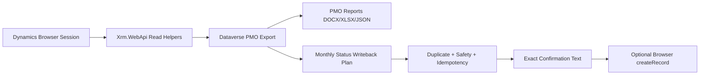

# Public Repository Readiness

Use this checklist before making the repository public or publishing a release package.

## Demo Flow

1. Open Dynamics in Codex Desktop and sign in manually.
2. Run `npm run status-report:dataverse`.
3. Use `TPGProjectAssist.downloadPmoProjectExport()` in the authenticated browser context.
4. Generate PMO reports from the real export:

```powershell
node ./scripts/statusbericht.js --pmo-suite <real-dataverse-export.json> --docx reports/pmo-suite.docx --xlsx reports/pmo-suite.xlsx --json
```

5. Generate a monthly status writeback plan:

```powershell
node ./scripts/statusbericht.js --monthly-status-plan <real-dataverse-export.json> --month YYYY-MM --json
```

6. Show that every write path requires project-manager verification, duplicate checks, blockers, and exact confirmation text.

## Public-Repo Checks

- Do not commit real exports, generated reports, screenshots, logs, access tokens, cookies, or browser state.
- Keep `reports/` ignored for local generated files.
- Keep examples synthetic and documentation-only.
- Keep productive CLI commands free of sample or fixture paths.
- Keep Status API writeback confirmation-gated.
- Run `npm test`, `npm run validate`, `npm run release:check`, and `npm audit --audit-level=moderate`.

## Architecture Signal



The default path is review-only. The optional API write path is available only in the authenticated browser context and only after explicit confirmation.
